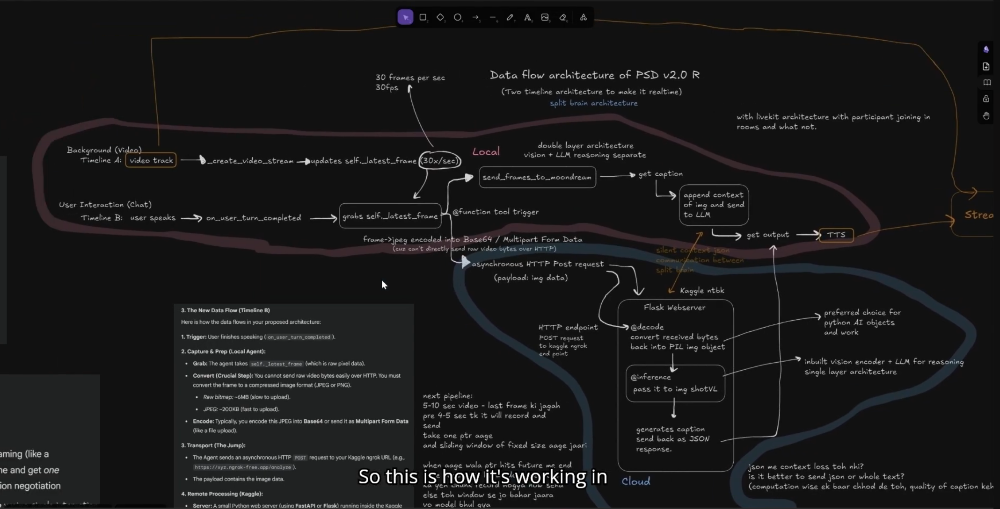

# Throughline
> *Give me a scene. I'll tell you how to execute your creative vision.*

Throughline analyses a photograph, understands what you're trying to achieve, 
and surfaces cinematographic decisions, composition flags, shooting styles, 
and camera settings grounded in how expert photographers actually think.

---

## What It Does

You give Throughline an image and a question. It:

1. **Parses your intent** - mood, subject, tone, focus, confidence
2. **Describes the scene** - what's actually in the frame
3. **Flags composition issues** - rule of thirds violations, headroom problems, subject placement
4. **Suggests shooting styles** - named, described, grounded in visual logic
5. **Maps camera settings per style** - ISO, aperture, shutter speed, white balance
6. **Gives a final recommendation** - which style fits this moment and why

```
User: Why does it look so good, Throughline?

Scene: Train on tracks, fence in foreground, rural landscape.
Composition flags: Subject not on vertical thirds, too much headroom.

Suggested styles:
  "Vintage Nostalgia"   → ISO 400, f/2.8, 1/250s, 2500K
  "Isolated Journey"    → ISO 100, f/11,  1/30s,  5500K  
  "Rustic Serenity"     → ISO 100, f/4,   1/125s, 5500K  ← recommended

Final: Shoot at golden hour. Place train on lower horizontal third. 
       Surrounding countryside fills the upper two-thirds.
```
## Working Screenshots


> Model with Thinking ON

> Final Recommendation

---

## Architecture Evolution
Update: The latest real-time version of Througline built with frameworks is in experimentation phase. 
Early stages of experimentations and minor versions at [PSD-V2.0R](https://github.com/step-code01/PSD_v2.0R), [V1R](https://github.com/step-code01/V1R_Throughline).
Here's the demo of me explaining the architecture about it and how it works. 
[](https://youtu.be/7jx8Hn23vSE?si=ShUHH0PEjKbGLqVh&t=191)

This is not the first version. It's the result of 7 months and 5 approaches, 
each failure redefining what the problem actually was. The below table only showcases major architectural changes and WHY. 

| Approach | What I thought would work | What it taught me | Demo of Each Stage |
|----------|--------------------------|-------------------|-------------------|
| Hardcoded DIP rules (Sobel, Haar, OpenCV) | Rule-based composition detection would be enough | Cinematographic decisions are contextual, not rule-based. Rules describe outcomes, not decisions. | [Watch](https://drive.google.com/file/d/1x3oZgMFWHQIa9mN4C0ynIat0Mi66kF1H/view?usp=sharing)  |
| Dual-route perception-reasoning | Separate intent parsing from scene analysis, route accordingly | Routing logic broke on low-confidence intent. The fallback was doing all the work. The two routes were solving different problems. | [Watch](https://drive.google.com/file/d/1v2Nx3zO0oYAjFhLlv7YwTcTOqHlwyaGc/view?usp=sharing)
| Vision LLMs direct | Let the model reason end-to-end | Too generic. No cinematographic grounding. Confident but shallow. | - |
| Metadata extraction + grounding feedback | Ground suggestions with metadata, not rules | Priors didn't transfer well across scene types. Needed retrieval, not injection. | [Eg1](https://drive.google.com/file/d/1XW-8m-OWg9GhTjaPBo7gGL9Ba73bOp2G/view?usp=sharing) [Eg2](https://drive.google.com/file/d/1v2Nx3zO0oYAjFhLlv7YwTcTOqHlwyaGc/view?usp=sharing) |
| ShotVL-based cinematographic priors | Inject domain-specific visual priors | The actual problem is retrieval + reasoning over film corpora. | 

Full iteration logs, architecture sketches, and weekly notes are in [/devlog](./devlog).  (Will upload once I clean 8+ weeks of files up)

---

## The Actual Problem (As I Now Understand It)

Cinematographic technique selection is **emergent and contextual**.
An expert cinematographer looking at a scene doesn't apply rules,
they pattern-match against thousands of shots they've seen before
and reason about why a technique served *that specific moment*.

The system needs to do the same:
retrieve visually and semantically similar frames from reference films,
surface the technique decision that was made,
and explain why it fits the current scene.

That's not a classification problem. It's a retrieval and reasoning problem.
Getting there.

---

## Current State

The dual-route engine (`v2-engine`) is functional for style suggestion 
and camera settings. Intent parsing and scene description are working. 
Case-based reasoning over film corpora is in progress.

This is a working research prototype, not a finished product.

---

## Stack

Python, FastAPI, OpenCV, Vision LLMs, Hugging Face Transformers

---

## Devlog

Weekly notes, architecture sketches (Excalidraw), and A/B testing 
results are in [/devlog](./devlog). Raw, unedited, dated. (Will upload once I clean 8+ weeks of files up)
